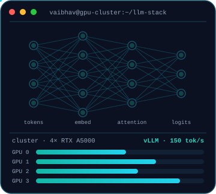

<div align="center">




<br/>

[](https://linkedin.com/in/vaibhav-arya717853202)
[](mailto:aryav210@gmail.com)
[](https://interview.codevik.xyz)


</div>

<br/>

## 👨‍💻 About Me



```python
class VaibhavArya:
    role      = "AI/ML Engineer"
    focus     = ["Generative AI", "LLM Fine-Tuning", "RAG", "Agentic Systems"]
    company   = "Leading UPSC EdTech platform · New Delhi"
    education = "B.Tech AI · Galgotias College of Engineering & Technology"

    builds    = ["RAG course assistants", "Voice-native multi-agent interviewers",
                 "Self-hosted LLM serving on multi-GPU clusters"]
    cares     = ["Latency & cost per token", "Eval-driven quality",
                 "Owning the stack end-to-end"]
    location  = "New Delhi, India 🇮🇳"
```

- 🤖 **LLM Applications** — production RAG (hybrid BM25 + semantic), LangGraph / LangChain agents, MCP servers, tool calling, structured outputs
- 🧬 **Fine-Tuning** — QLoRA / LoRA with Unsloth, Axolotl & HF TRL; PyTorch DDP across **4× NVIDIA RTX A5000**
- ⚡ **Inference & Serving** — vLLM + GPUStack, quantization, KV caching, streaming, chunked map-reduce over 100K-token inputs
- 🎙️ **Voice AI** — LiveKit, Whisper STT, ElevenLabs TTS, sub-second STT → LLM → TTS loops
- 📈 **Track record** — promoted twice in 18 months (Intern → Analyst → Engineer); sole owner of the in-house LLM stack & GPU infra
- 🎓 Certified: **AWS** — Planning a Generative AI Project · Building a Generative AI-Ready Organisation · Introduction to Generative AI

<br clear="right"/>

---

## 📊 Impact at a Glance


---

## 💼 Experience

<table>
<tr>
<td width="50%" valign="top">

### 🚀 AI-ML Engineer
**Leading UPSC EdTech Platform** · Apr 2026 – Present

- Scaled training across **4× RTX A5000** with PyTorch DDP + torchrun; tuned NCCL, batch size & grad accumulation for **~4× faster** training with crash-safe checkpointing
- Built an LLM **question-upload pipeline** (images, tables, complex formatting) that replaced a manual uploader workflow — **5 hours → 15 minutes** per batch incl. human review
- **Long-context inference:** chunked map-reduce summarization of 100K-token transcripts beyond single-GPU memory, with token-budgeted prompting & streaming
- Refactored legacy AI pipelines to cut failure rates; workflow automations running at up to **95% accuracy**

</td>
<td width="50%" valign="top">

### 🧠 AI & Automation Analyst
**Leading UPSC EdTech Platform** · Jun 2025 – Mar 2026

- Shipped the **RAG course assistant** end-to-end for **100K+ users** — timestamped video retrieval (PostgreSQL + Weaviate), hybrid search, RAG quizzes, web-search fallback
- Built a **6-agent voice interview simulator** (LiveKit, WebSockets, Perplexity + RAG tools) — **2,000+ candidates**, sub-second latency, **70% lower cost**
- **Automated Mains answer evaluation** (Gemini + Perplexity Search) for handwritten sheets — hours → **<10 min**, 70% cheaper
- **20-step agentic content pipeline:** S3 audio → transcription → generation → DB-sync → deploy, zero manual steps
- Self-hosted Whisper large-v3 & gpt-oss on **vLLM + GPUStack** at up to **150 tok/s**
- LangSmith tracing + custom evals: **~20% fewer hallucinations**, **~25% better** response quality

</td>
</tr>
<tr>
<td colspan="2" valign="top">

### 🌱 Generative AI Intern
**Leading UPSC EdTech Platform** · Feb 2025 – May 2025

- Built custom **MCP tool servers** (FastAPI, WebSocket) giving LLMs real-time access to internal data & tools &nbsp;·&nbsp; Co-built the first **timestamp-aware video Q&A chatbot** with guardrails and LangSmith monitoring — the foundation for the 100K-user assistant &nbsp;·&nbsp; **Whisper STT + custom-scoring** pipeline to transcribe and grade daily sales/support calls &nbsp;·&nbsp; Enterprise **RAG tuning** (embedding, chunking, hybrid-search experiments) and automation with n8n & Dify

</td>
</tr>
</table>

---

## 🛠️ Featured Systems

<table>
<tr>
<td width="50%" valign="top">

### 🎙️ Voice-Native UPSC Interview Simulator
`LiveKit` `WebSockets` `Perplexity API` `RAG` `Multi-provider LLM routing`

- 6 cooperating agents with distinct personas & dynamic prompting
- Tool access to live web search + RAG; streaming STT → LLM → TTS loop
- Prototyped on Vapi and LiveKit, then taken to production

**⚡ Sub-second latency · 70% lower cost/session · 2,000+ candidates**

</td>
<td width="50%" valign="top">

### 🧬 Multi-GPU LLM Fine-Tuning Platform
`Unsloth` `QLoRA` `Axolotl` `PyTorch DDP` `HF TRL` `vLLM` `4× RTX A5000`

- Replaced slow, costly third-party APIs for 100K-token bilingual lecture summaries
- Owned dataset curation → QLoRA fine-tune of Gemma-4 E2B → DDP scaling → OOM debugging → checkpointing
- vLLM serving with chunked map-reduce inference

**⚡ ~4× faster training · structured HTML summaries at 8K ctx · zero per-token API spend**

</td>
</tr>
<tr>
<td width="50%" valign="top">

### 💬 Production RAG Course Assistant
`FastAPI` `PostgreSQL` `Weaviate` `BM25 + Semantic` `LangSmith`

- Timestamped video retrieval over chunked transcripts
- RAG-generated UPSC quizzes + web-search fallback for current affairs
- LLM tracing & evaluation with LangSmith and custom checks

**⚡ 100K+ users · ~20% fewer hallucinations · ~25% better response quality**

</td>
<td width="50%" valign="top">

### 🖥️ Self-Hosted LLM Serving Platform
`vLLM` `GPUStack` `Docker` `Nginx` `RTX A5000`

- Whisper large-v3 (faster-whisper), gpt-oss and other open-weight models
- Quantization, KV caching and streaming generation
- A private, low-cost inference endpoint for every internal AI workflow

**⚡ Up to 150 tok/s · Dockerized services scaled for enterprise load**

</td>
</tr>
<tr>
<td colspan="2" valign="top">

### 🎯 Practice Mock Interviews — AI Voice Interviewer &nbsp;·&nbsp; [🔗 Live Demo](https://interview.codevik.xyz) &nbsp;<sub>personal project</sub>
`LiveKit` `FastAPI` `Next.js 15` `OpenAI` `Gemini` `Groq Whisper` `Docker Compose` `LaTeX`

- An AI interviewer reads the candidate's parsed resume and target JD, then runs a live, low-latency STT → LLM → TTS interview
- 4-stage **"Full Prep"** pipeline (parse → JD skill analysis → LaTeX resume build → Q&A generation) auto-produces a role-optimized resume PDF and ~10 Q&As per project
- Async FastAPI with semaphore-bounded concurrency, per-session work dirs, LiveKit room/token dispatch, server-side Next.js upload proxying, pluggable STT & resume-parsing providers, one-command Docker Compose deploy with TeX Live baked in

</td>
</tr>
</table>

---

## 🧰 Tech Stack

<details open>
<summary><b>🤖 AI & LLM Engineering</b></summary>
<br/>


</details>

<details open>
<summary><b>🧬 Training & Fine-Tuning</b></summary>
<br/>


</details>

<details open>
<summary><b>⚡ Inference & Serving</b></summary>
<br/>


</details>

<details open>
<summary><b>🧠 Models & APIs</b></summary>
<br/>


</details>

<details open>
<summary><b>🗄️ Data & Vector Stores</b></summary>
<br/>


</details>

<details open>
<summary><b>☁️ Infra & DevOps</b></summary>
<br/>


</details>

<details>
<summary><b>🎙️ Voice, Automation & Observability</b></summary>
<br/>


</details>

<details>
<summary><b>💻 Languages</b></summary>
<br/>


</details>

---

## 📂 Featured Repositories

| Repository | About |
|---|---|
| [**MCP-samples**](https://github.com/VaibhavNikkuV/MCP-samples) | Sample Model Context Protocol servers and tool integrations for LLMs |
| [**Llama3RAGchatbot**](https://github.com/VaibhavNikkuV/Llama3RAGchatbot) | Retrieval-augmented chatbot built on Llama 3 |
| [**Resume_modifier**](https://github.com/VaibhavNikkuV/Resume_modifier) | A tool for modifying and managing resumes |
| [**Natural-Language-Processing**](https://github.com/VaibhavNikkuV/Natural-Language-Processing) | NLP experiments and notebooks |
| [**Banglore_House_Prediction**](https://github.com/VaibhavNikkuV/Banglore_House_Prediction) | End-to-end ML regression project on Bengaluru housing data |
| [**Projects**](https://github.com/VaibhavNikkuV/Projects) | Collection of ML / DL project notebooks |

---

## 📊 GitHub Analytics

<div align="center">


<br/><br/>


<br/><br/>


<br/><br/>


</div>

---

## 🎓 Education & Certifications

**B.Tech, Artificial Intelligence** — Galgotias College of Engineering & Technology, Greater Noida · 2021 – 2025


---

## 🤝 Let's Connect

<div align="center">

<a href="https://linkedin.com/in/vaibhav-arya717853202"></a>
<a href="mailto:aryav210@gmail.com"></a>
<a href="https://interview.codevik.xyz"></a>

<br/><br/>

*Open to collaborations on LLM fine-tuning, RAG & agentic systems, and running open-weight models in production.*

<br/>


</div>
